# Indiana Megapack Project!

#### Author: Julysfire
Discord: julysfire#9465        MSFS2020: blackflame0729

### Description
This will have many handcrafted airports avilable in individual packages with enhancements to scenery in Indiana!

Currently Included Airports
- KMCX - White County Airport, Monticello
- KOXI - Stark County Airport, Knox
- KIWH - Wabash Municipal Airport, Wabash
- 1I8  - Converse Airport, Converse

- WIP: KBFR is currently a work in progress pending custom 3D assets (see second paragraph in 'Current Status')

### Summary
I started with Neofly from my homestate of Indiana in my alma mater of Purdue University (KLAF).  Upon doing some flying to different smaller airports in Indiana, I noticed that a lot of the scenery and airports could use a bit love.  The goal of this megapack is to update a lot of the smaller Indiana airports as well as making Indiana look as close to real life as possible.

For the most up to date files, the ones above can be downloaded.  I will still have releases on here, FlightSim.to and Nexusmods, however those will be a bit less frequent.  At the top, if you click on the "Code" button and select "Download as Zip", once you extract the ZIP folder, you will have the most recent files and you can choose which ones you want to add to your Community folder.

### Current Status
Working on getting a lot of vegetation up to date.  There aren't too many height updates.  Trying to not cover up houses and roads with trees.

I have a list of airports so far that I would like to work on but I am taking a step away from airports as the custom 3D modeling isn't my fortay and I have been having a lot less free time to dedicate to continued growth in Blender so right now, making 3D custom objects is extremely time consuming.  Working on vegetation/height/water/some scenery fixes on the other hand is a lot better and I even find it relaxing so I want to continue working on these type of items in the future.  Airports where I can fit a lot of the default scenery that can blend well and looks close to what is there will be worked on as well.  I enjoy improving airports, just not the 3D modeling as much currently.  This may change depending on a lot of IRL stuff.

### Features
- Hand crafted airports and scenery of surrounding area.
- Plenty of GA parking spots at each airport.
- Some water height level fixes along the Tippecanoe river.
- Additional water fixes of rivers/lakes/ponds/streams not counting as water.
- Added **lots** of vegetation and water where auto generated spots failed.  Also fixed a lot of issues where additional vegetation was spawning where it was not supposed to (biggest issue is on top of power lines, on railroad tracks, on roads, or in fields).
- Current Amount of vegetation/height/water fixes: **11046**.
- Added 170 missing Wind Turbines
- Added 90 missing power line towers
- Realistic look and feel.
- Realistic night lighting around the hangars/runway/aprons.

### ---Installation Instructions---

I have opted for a structure that will make this pack as modular as possible.  Each folder above is going to be a different airport/scenery item.  The above folders are the items that go into your Community folder.  This means you can mix and match any airport sets you want.  While not required, I recommend at least the vegetation/height folder (any airport dependent terrain corrections are housed in their airport's folder).

1. Download the .zip file and extract the .zip folder to a desired location.  Alternatively, you can download everything (at the top on Github, Click the green Code button and Download ZIP).
2. Move the desired folders into your Microsoft Flight Simulator Community Folder.  This will allow you to have a choice of which airports to include.  Each airport is within it's own folder.

For the Microsoft Store edition AND/OR Gamepass edition:

	C:\Users\[YOUR USERNAME]\AppData\Local\Packages\Microsoft.FlightSimulator_<RANDOMLETTERS>\LocalCache\Packages\Community
	
For the Steam edition:

	C:\Users\[YOUR USERNAME]\AppData\Roaming\Microsoft Flight Simulator\Packages\Community
	
For the Boxed edition:

	C:\Users\[YOUR USERNAME]\AppData\Local\MSFSPackages\Community

## Full List of Corrections Terrain/Veg/Water Corrections as of 5/12/2021
#### Click map to go to Google Map version!

## Screenshots

## KMCX - White County Airport, Monticello

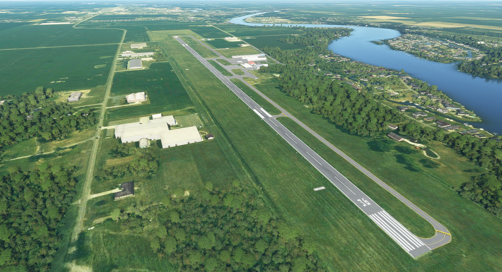

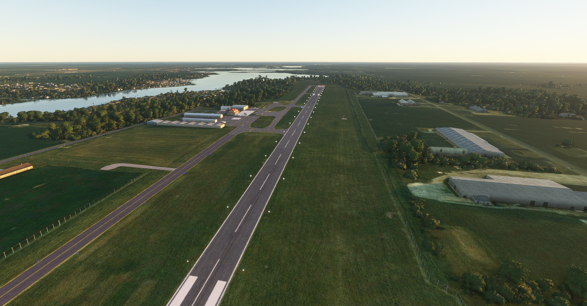

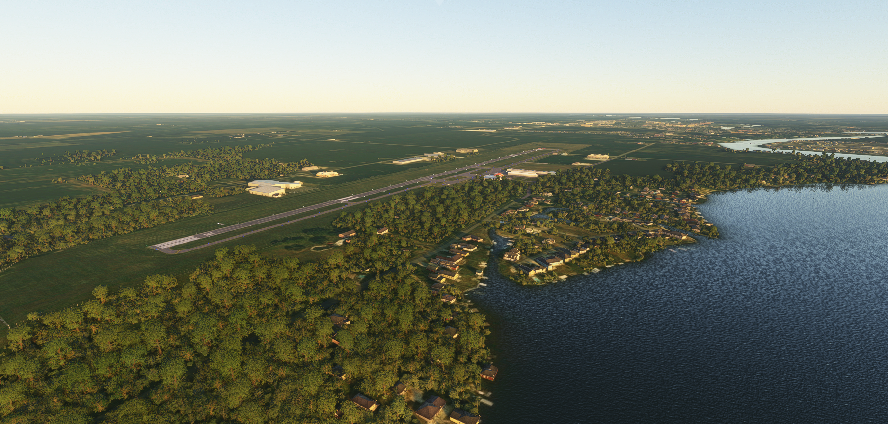

## KOXI - Stark County Airport, Knox

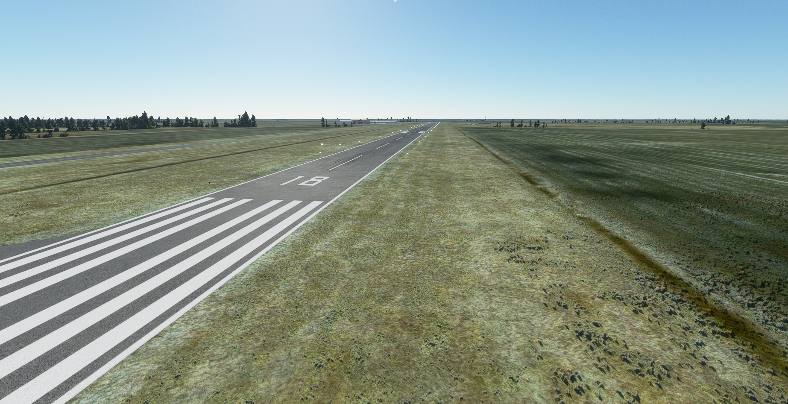

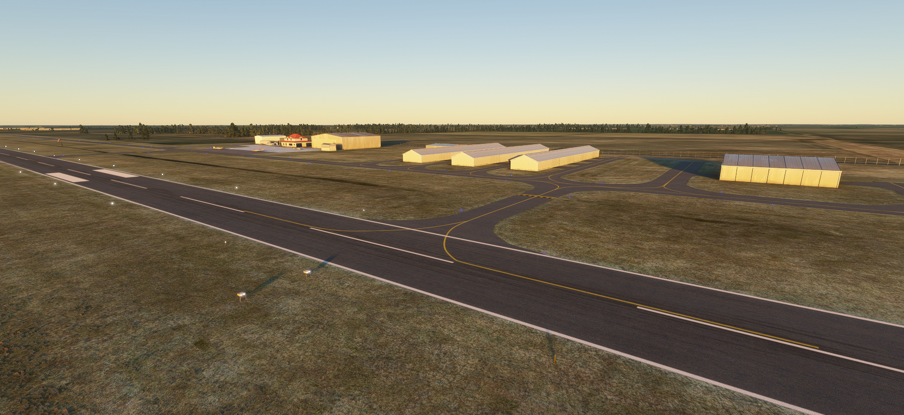

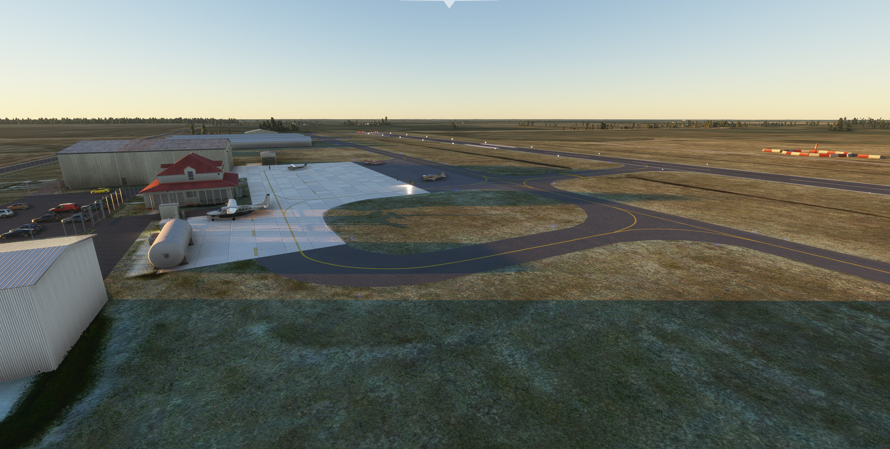

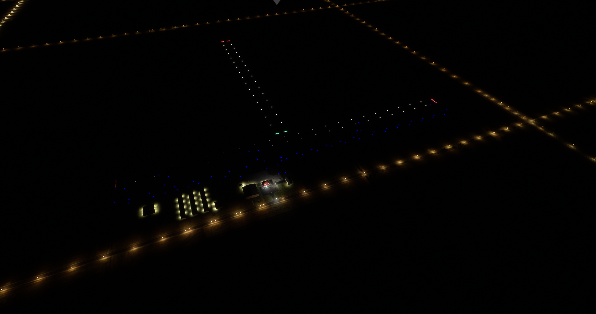

## KIWH - Wabash Municipal Airport, Knox

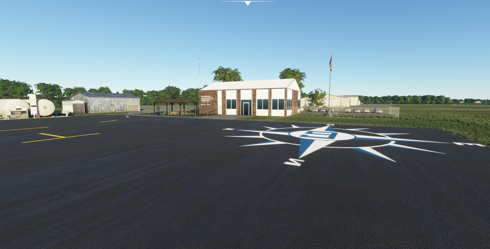

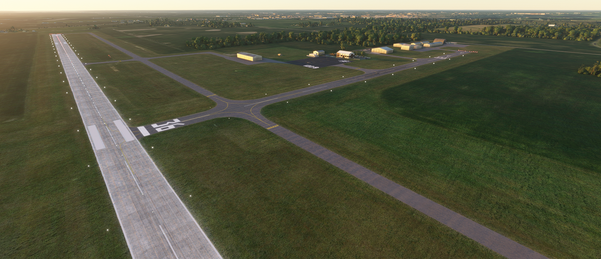

## 1I8 - Converse Airport, Converse

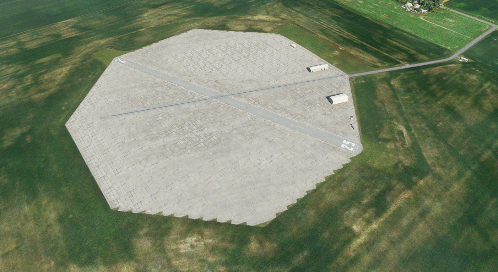

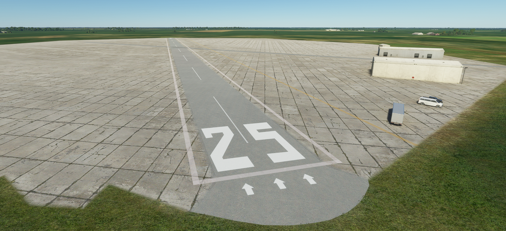

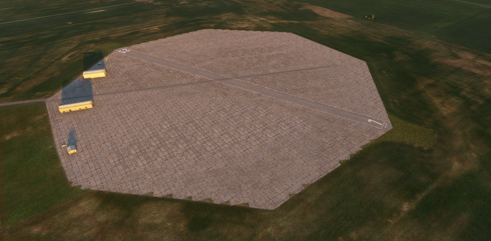

## Example of Vegetation Updates
### A lot of vegetation is not reconigzed in the Sim and is manually updated.  This is done all around the state.

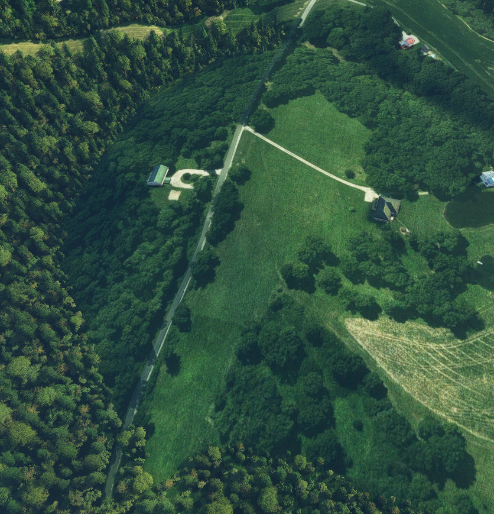

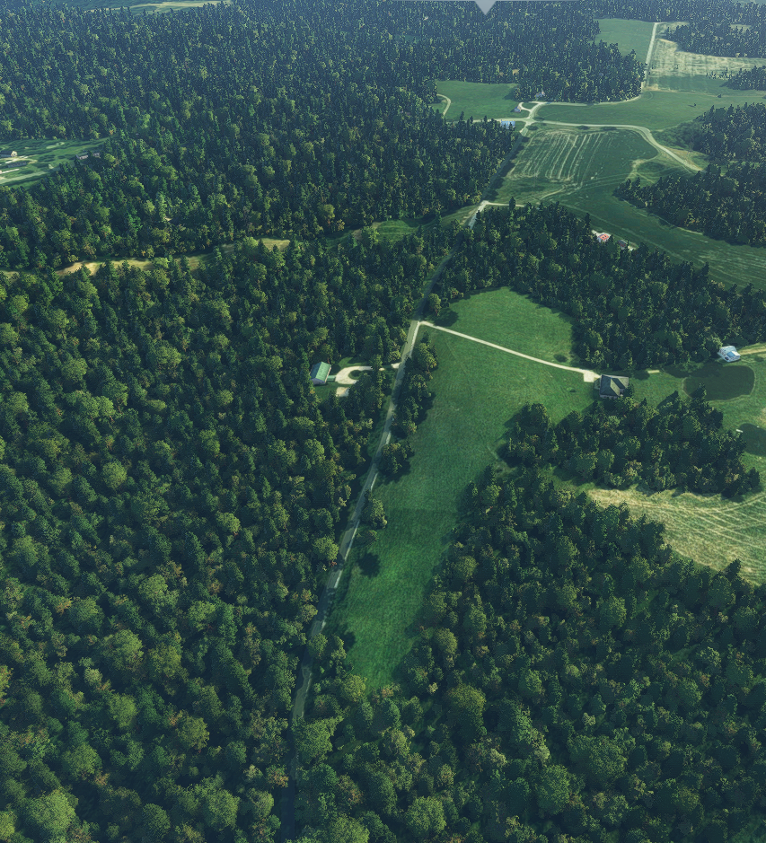

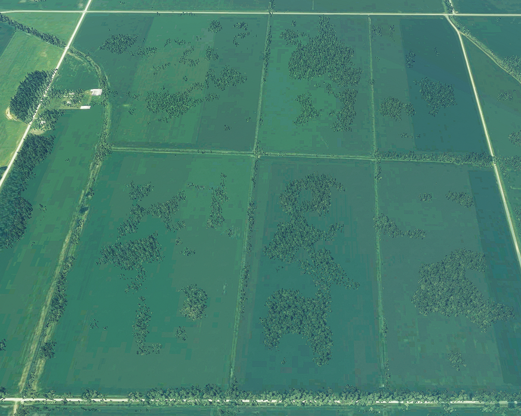

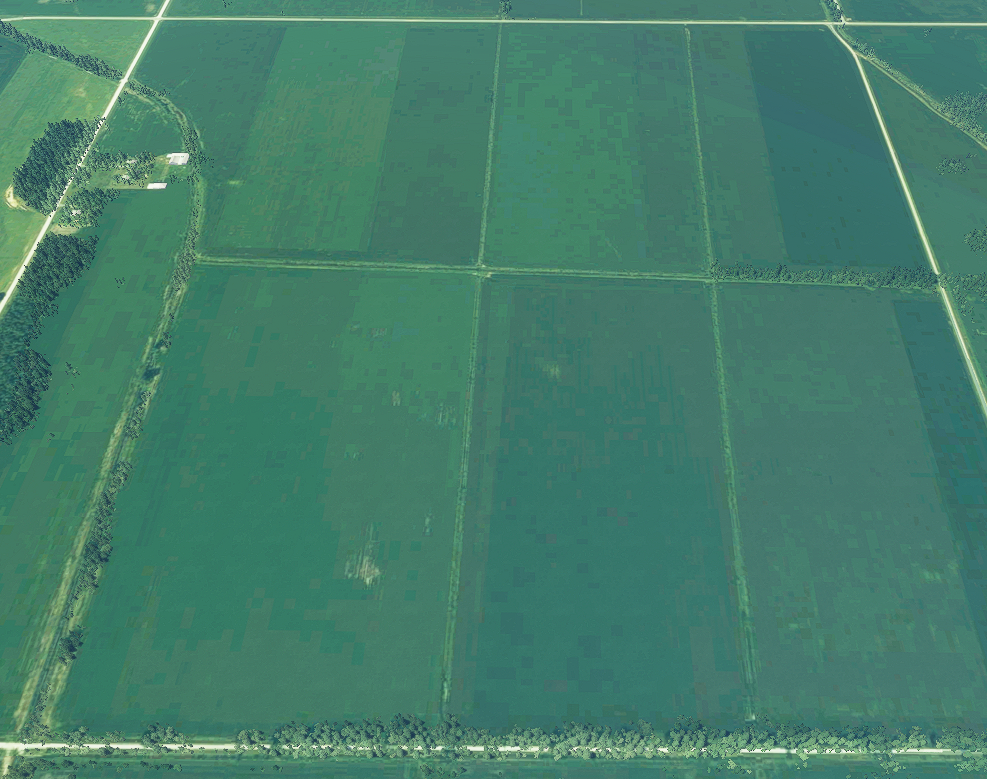

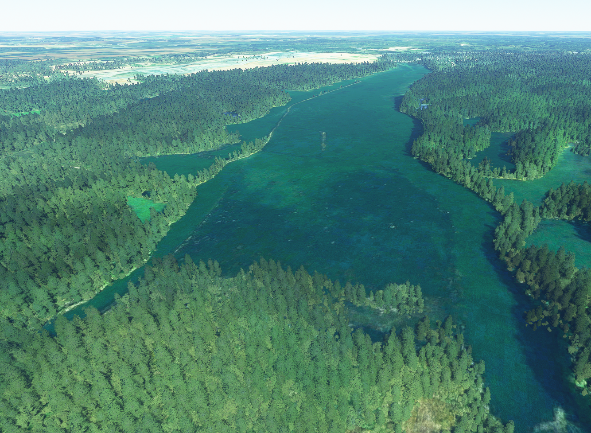

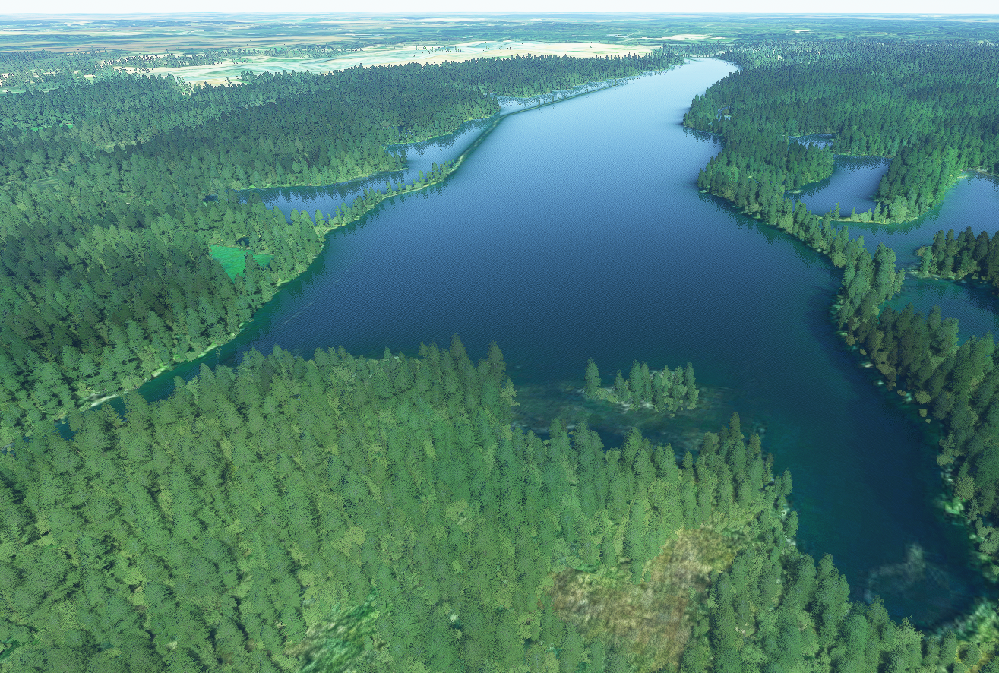

#### Notice
Do not redistribute/host unless given prior consent.  External linking to this page/site/files is okay.

If you enjoyed it as well and would like to donate, it is very much appreciated but never will be required.  I am doing this to add to the community's total assets of airports and scenery and because honestly, I found I really enjoy doing this.  I only strive to make content that others can enjoy.
http://paypal.me/julysfire or https://www.buymeacoffee.com/julysfire
